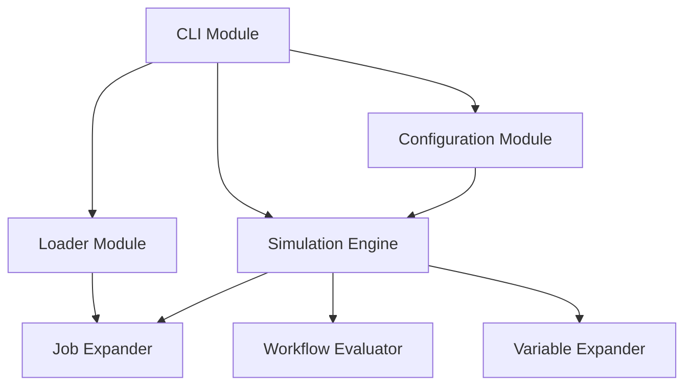

# System Patterns

## Architecture Overview

Cimulator follows a modular architecture with clear separation of concerns. Each module handles a specific aspect of GitLab CI pipeline simulation, allowing for independent development, testing, and maintenance.

## Core Components

### 1. Loader Module
- **Responsibility**: Loads and parses GitLab CI YAML files, resolving includes recursively.
- **Key Functions**:
  - `load_yaml()`: Loads a YAML file into a dictionary.
  - `merge_dicts()`: Recursively merges dictionaries.
  - `resolve_includes()`: Resolves and merges included YAML files.
  - `load_and_resolve()`: Main entry point that loads the root file and resolves all includes.
- **Design Pattern**: Composite pattern for handling nested includes.

### 2. Job Expander Module
- **Responsibility**: Expands job definitions using the "extends" mechanism.
- **Key Functions**:
  - `expand_job()`: Recursively expands a job definition.
  - `expand_all_jobs()`: Expands all job definitions in a configuration.
- **Design Pattern**: Decorator pattern for building up job definitions.

### 3. Workflow Module
- **Responsibility**: Evaluates workflow rules to determine if a pipeline should run.
- **Key Functions**:
  - `evaluate_condition()`: Evaluates a condition string against variables.
  - `evaluate_rules()`: Evaluates a list of rules to determine if a job should run.
  - `evaluate_workflow()`: Evaluates the workflow configuration.
- **Design Pattern**: Strategy pattern for rule evaluation.

### 4. Variable Expander Module
- **Responsibility**: Expands variables in strings, dictionaries, and lists.
- **Key Functions**:
  - `expand_variables_in_string()`: Replaces variable placeholders in a string.
  - `expand_variables()`: Recursively expands variables in an object.
- **Design Pattern**: Visitor pattern for traversing and transforming data structures.

### 5. Configuration Module
- **Responsibility**: Loads simulation configuration files.
- **Key Functions**:
  - `load_simulation_config()`: Loads a simulation configuration YAML file.
- **Design Pattern**: Simple factory for configuration objects.

### 6. Simulation Engine Module
- **Responsibility**: Orchestrates the simulation process.
- **Key Functions**:
  - `simulate_pipeline()`: Simulates a pipeline by processing jobs, evaluating workflow rules, and expanding variables.
- **Design Pattern**: Facade pattern providing a simplified interface to the complex subsystems.

### 7. CLI Module
- **Responsibility**: Provides the command-line interface.
- **Key Functions**:
  - `main()`: Entry point for the CLI.
- **Design Pattern**: Command pattern for encapsulating requests as objects.

## Data Flow

1. **Input Processing**:
   - CLI receives input paths for the GitLab CI file and simulation configuration file.

2. **File Loading**:
   - Loader module reads the root YAML and all included files, returning a merged configuration dictionary.

3. **Job Extraction & Expansion**:
   - Extract job definitions.
   - Expand jobs by processing extends entries with the job expander module.

4. **Workflow Processing**:
   - Parse the workflow section and evaluate it based on the configuration manager's variable values.

5. **Variable Expansion**:
   - The variable expander applies configuration-provided variable values to the expanded jobs.

6. **Simulation**:
   - The simulation engine takes the final job definitions and workflow decisions to simulate the pipeline.

7. **Output**:
   - Results (validation output, simulation summary, or error messages) are printed to the console.

## Key Technical Decisions

1. **Recursive Processing**: Using recursion for handling nested includes and job extensions.
2. **Deep Dictionary Merging**: Implementing GitLab's specific rules for merging dictionaries and arrays.
3. **Condition Evaluation**: Converting GitLab CI condition syntax to Python-evaluable expressions.
4. **Modular Design**: Separating concerns into distinct modules for better maintainability.
5. **Logging**: Using Python's logging module for detailed debugging information.
